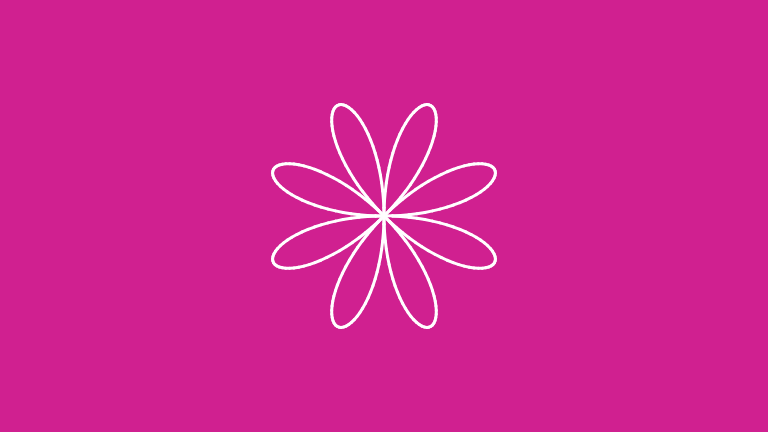
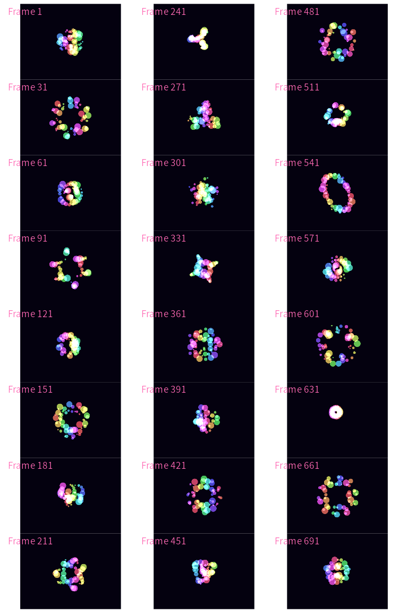

# skiagd


<!-- README.md is generated from README.Rmd. Please edit that file -->

<!-- badges: start -->

[](https://github.com/rust-skia/rust-skia/releases/tag/0.91.1)
[](https://github.com/paithiov909/skiagd/actions/workflows/R-CMD-check.yaml)
[![DeepWiki](https://img.shields.io/badge/DeepWiki-paithiov909%2Fskiagd-blue.svg?logo=data:image/png;base64,iVBORw0KGgoAAAANSUhEUgAAACwAAAAyCAYAAAAnWDnqAAAAAXNSR0IArs4c6QAAA05JREFUaEPtmUtyEzEQhtWTQyQLHNak2AB7ZnyXZMEjXMGeK/AIi+QuHrMnbChYY7MIh8g01fJoopFb0uhhEqqcbWTp06/uv1saEDv4O3n3dV60RfP947Mm9/SQc0ICFQgzfc4CYZoTPAswgSJCCUJUnAAoRHOAUOcATwbmVLWdGoH//PB8mnKqScAhsD0kYP3j/Yt5LPQe2KvcXmGvRHcDnpxfL2zOYJ1mFwrryWTz0advv1Ut4CJgf5uhDuDj5eUcAUoahrdY/56ebRWeraTjMt/00Sh3UDtjgHtQNHwcRGOC98BJEAEymycmYcWwOprTgcB6VZ5JK5TAJ+fXGLBm3FDAmn6oPPjR4rKCAoJCal2eAiQp2x0vxTPB3ALO2CRkwmDy5WohzBDwSEFKRwPbknEggCPB/imwrycgxX2NzoMCHhPkDwqYMr9tRcP5qNrMZHkVnOjRMWwLCcr8ohBVb1OMjxLwGCvjTikrsBOiA6fNyCrm8V1rP93iVPpwaE+gO0SsWmPiXB+jikdf6SizrT5qKasx5j8ABbHpFTx+vFXp9EnYQmLx02h1QTTrl6eDqxLnGjporxl3NL3agEvXdT0WmEost648sQOYAeJS9Q7bfUVoMGnjo4AZdUMQku50McDcMWcBPvr0SzbTAFDfvJqwLzgxwATnCgnp4wDl6Aa+Ax283gghmj+vj7feE2KBBRMW3FzOpLOADl0Isb5587h/U4gGvkt5v60Z1VLG8BhYjbzRwyQZemwAd6cCR5/XFWLYZRIMpX39AR0tjaGGiGzLVyhse5C9RKC6ai42ppWPKiBagOvaYk8lO7DajerabOZP46Lby5wKjw1HCRx7p9sVMOWGzb/vA1hwiWc6jm3MvQDTogQkiqIhJV0nBQBTU+3okKCFDy9WwferkHjtxib7t3xIUQtHxnIwtx4mpg26/HfwVNVDb4oI9RHmx5WGelRVlrtiw43zboCLaxv46AZeB3IlTkwouebTr1y2NjSpHz68WNFjHvupy3q8TFn3Hos2IAk4Ju5dCo8B3wP7VPr/FGaKiG+T+v+TQqIrOqMTL1VdWV1DdmcbO8KXBz6esmYWYKPwDL5b5FA1a0hwapHiom0r/cKaoqr+27/XcrS5UwSMbQAAAABJRU5ErkJggg==.png)](https://deepwiki.com/paithiov909/skiagd)
<!-- badges: end -->

[skiagd](https://github.com/paithiov909/skiagd) is an experimental
drawing library for R that wraps
[rust-skia](https://github.com/rust-skia/rust-skia) (the Rust crate
[skia_safe](https://rust-skia.github.io/doc/skia_safe/), a binding for
[Skia](https://skia.org/)).

## Installation

Due to the limitation of the upstream prebuilt binaries, it is available
only for Linux and macOS. To build from source, it requires freetype,
fontconfig, and the Rust toolchains.

``` r
remotes::install_github("paithiov909/skiagd")
```

## Examples

### Overview

skiagd takes a pipeline‑oriented philosophy similar to
[ggplot2](https://ggplot2.tidyverse.org/) but directs it at pure
graphics rather than data visualisation. In a skiagd pipeline, there are
three main steps to draw an image:

1.  **Create a canvas** with a background colour. The call `canvas()`
    returns a new
    [picture](https://shopify.github.io/react-native-skia/docs/shapes/pictures/)
    object that represents the drawing state.
2.  **Compose shapes** by piping calls to `add_*()` functions. Each
    `add_*()` call takes the current picture, adds shapes to it, and
    returns a new picture. The picture object always remains a recipe of
    drawing commands, no pixels are produced at this stage.
3.  **Render the picture**. To convert a picture into pixels you can
    call…
    1.  `draw_img()` to draw to the current graphics device
    2.  `as_nativeraster()` to obtain a nativeRaster
    3.  `as_png()` to obtain a PNG as a raw vector

Despite its name, skiagd presents itself as a toy R wrapper for
rust-skia and does not behave like a graphics device. The package is
meant to draw images independently of R’s graphics device system.

### Painting Attributes

Skia exposes a rich set of [painting
attributes](https://paithiov909.r-universe.dev/skiagd/doc/manual.html#paint)
that control how shapes appear when drawn. In skiagd, you can specify
these attributes via the `paint()` function and pass the resulting
object to the `props` argument of `add_*()`. Unspecified attributes
inherit defaults, many of which follow the current graphics device’s
settings.

The following example illustrates a basic drawing pipeline.

``` r
library(skiagd)

rad <- \(deg) deg * (pi / 180)

# Canvas size in pixels (from the current graphics device)
cv_size <- dev_size()

# Generate coordinates for a rose curve
rose <-
  dplyr::tibble(
    i = seq_len(360),
    r = 120 * abs(sin(rad(4 * i)))
  ) |>
  dplyr::reframe(
    x = r * cos(rad(360 * i / 360)) + cv_size[1] / 2,
    y = r * sin(rad(360 * i / 360)) + cv_size[2] / 2,
    z = 1
  )

canvas("violetred") |>
  add_point(
    rose,
    props = paint(
      color = "white",
      width = 3,
      point_mode = PointMode$Polygon,
    )
  ) |>
  draw_img()
```



Here we first generate coordinates for a simple rose curve and then draw
it with a single call to `add_point()`. We supply the points as a matrix
and specify painting attributes via `paint()`. Here we set the colour to
`"white"`, the line width to `3` pixels and use `PointMode$Polygon` to
connect successive points. And finally, we call `draw_img()` to render
the picture on the current graphics device.

### Showcase

The following example, inspired by [this blog
post](https://georgemsavva.github.io/creativecoding/posts/mystery/),
demonstrates how skiagd can be used to create a more practical artwork.

``` r
cv_size <- dev_size()
cv_size
#> [1] 768 576

n_frames <- 720
n_circles <- 50
radius <- runif(n_circles, min = .25, max = 2) |> sort()
trans <- matrix(c(60, 0, cv_size[1] / 2, 0, 60, cv_size[2] / 2, 0, 0, 1), ncol = 3)

circle <- \(amp, freq, phase) {
  amp * 1i^(freq * seq(0, 600, length.out = n_circles) + phase)
}

dir <- tempdir()
imgs <- purrr::imap_chr(seq(0, 4 * pi, length.out = n_frames + 1)[-1], \(a, i) {
  # Compute a stack of circles with changing amplitudes and phases
  l <- sin(pi * (2 * a - .5)) + 1
  z <- circle(pi / 6, -pi, 0) +
    circle(l, ceiling(a), -9 * cos(a) + 1) +
    circle(l / 2 - 1, ceiling((-a + (7 / 2)) %% 7) - 7, -7 * cos(a) + 1)

  hue <- (a + (Re(z / pi))) %% 1
  colours <- grDevices::hsv(hue, .66, .75, alpha = 1)

  # Build one frame
  png <- canvas("#04010F") |>
    add_circle(
      cbind(Re(z), Im(z), 1) %*% trans,
      radius = log(max(cv_size), exp(.5)) * radius,
      color = col2rgba(colours),
      props = paint(
        style = Style$Fill,
        blend_mode = BlendMode$Plus,
      )
    ) |>
    as_png()

  fp <- file.path(dir, sprintf("%04d.png", i))
  writeBin(png, fp)
  fp
})
```

The animation consists of multiple rotating circles whose radii and
phases change over time. You don’t need to understand the details of the
trigonometry here, the key takeaway is that you can compute complex
coordinates in R, pipe them into `add_circle()`, and then assemble the
frames into a GIF using [gifski](https://github.com/r-rust/gifski).

``` r
# Combine frames into a GIF (30 fps)
gifski::gifski(
  imgs,
  "mystery-circles.gif",
  width  = cv_size[1],
  height = cv_size[2],
  delay  = 1 / 30
)
```

The frames in the GIF look like this:



## Further Readings

- [Rediscover Fragment Shaders in R, with
  skiagd](https://paithiov909.github.io/shiryo/rediscover-shaders-in-r/)
- [R言語でのアート制作・Rtistryを考える
  (Japanese)](https://zenn.dev/paithiov909/articles/skiagd-rtistry)

## License

MIT License.
