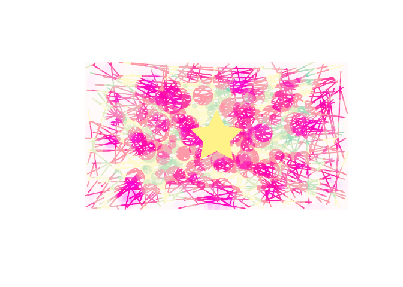

# skiagd


<!-- README.md is generated from README.Rmd. Please edit that file -->

<!-- badges: start -->

[](https://lifecycle.r-lib.org/articles/stages.html#experimental)
[](https://github.com/paithiov909/skiagd/actions/workflows/R-CMD-check.yaml)
<!-- badges: end -->

skiagd is a toy R wrapper for
[rust-skia](https://github.com/rust-skia/rust-skia) (the rust crate
[skia_safe](https://rust-skia.github.io/doc/skia_safe/), a binding for
[Skia](https://skia.org/)).

Despite its name, this package is intended as a graphics library, not a
graphics device for R 😓

## Design notes

- This is not a graphics device. skiagd does not allow R’s session to
  hold a reference to a Canvas object on Rust side.
- Drawing functions return a
  [picture](https://shopify.github.io/react-native-skia/docs/shapes/pictures/)
  as a `raw` object every time it’s called. `add_*` puts those data onto
  canvas, actually ***adds*** some paintings to there, and then returns
  a `raw` object again.

## Future plan

I’m planning to re-implement features like [React Native
Skia](https://shopify.github.io/react-native-skia/).

### Maybe in the near future??

- Shapes
  - Path
    - [x] SVG notation (path)
  - Polygons
    - [x] Rect
    - [x] RoundedRect (round_rect)
    - [x] DiffRect (drrect)
    - [x] Line
    - [x] Points (points; not point)
  - Ellipses
    - [x] Circle
    - [ ] Oval (oval)
    - [ ] Arc (arc)
  - Atlas
  - Vertices
  - Patch
- Images
  - [x] PNG
- Text
  - Paragraph
  - Text
  - Glyphs
  - Text Path
  - Text Blob
- Painting Attributes
  ([Paint](https://rust-skia.github.io/doc/skia_safe/type.Paint.html))
  - [x] PathEffects
  - [ ] MaskFilter?? (blur)
  - [ ] ImageFilters
  - [ ] [Shaders](https://rust-skia.github.io/doc/skia_safe/type.Shader.html)
  - [ ] RuntimeShaders
    - sksl support
    - [uniforms](https://rust-skia.github.io/doc/skia_safe/runtime_effect/type.RuntimeShaderBuilder.html#method.set_uniform_int)
      support

### Possibly in the future??

- Fitting Images (needs to re-implement
  [this](https://github.com/Shopify/react-native-skia/blob/4192f839d7ffc5cb0aba91c0f0f97e595d5c8409/packages/skia/cpp/api/recorder/ImageFit.h))
- [Group](https://shopify.github.io/react-native-skia/docs/group/) /
  [Backdrop
  Filters](https://shopify.github.io/react-native-skia/docs/backdrops-filters)
- [Mask](https://shopify.github.io/react-native-skia/docs/mask/)

## Showcase

It’s still in early alpha stage. The API is subject to (maybe drastic)
change.

``` r
pkgload::load_all(export_all = FALSE)
#> ℹ Loading skiagd

img_data <-
  unigd::ugd_render_inline({
    set.seed(1234)
    size <- dev_size("px")
    n_circles <- 250
    canvas("snow") |>
      add_line(
        matrix(c(runif(300, 0, size[1]), runif(300, 0, size[2])), ncol = 2),
        matrix(c(runif(300, 0, size[1]), runif(300, 0, size[2])), ncol = 2),
        props = paint(color = "#fff28166", width = 6)
      ) |>
      add_circle(
        matrix(c(runif(n_circles,  0, size[1]), runif(n_circles, 0, size[2])), ncol = 2),
        runif(n_circles, 6, 50),
        props = paint(color = "#87ceeb66", blend_mode = BlendMode$ColorBurn)
      ) |>
      add_circle(
        matrix(c(runif(n_circles, 0, size[1]), runif(n_circles, 0, size[2])), ncol = 2),
        runif(n_circles, 20, 60),
        props = paint(color = "#ff1493aa", blend_mode = BlendMode$Overlay)
      ) |>
      add_path(
        "M 128 0 L 168 80 L 256 93 L 192 155 L 207 244 L 128 202 L 49 244 L 64 155 L 0 93 L 88 80 L 128 0 Z",
        transform = c(1, 0, (size[1] / 2 - 128), 0, 1, (size[2] / 2 - 128), 0, 0, 1),
        props = paint(color = "#fff281ee")
      ) |>
      draw_img()
  }, as = "png", width = 1280, height = 720)

img_data |>
  magick::image_read() |>
  as.raster() |>
  plot()
```


