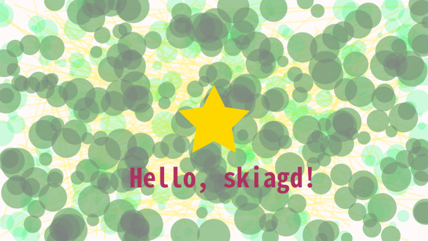

# skiagd


<!-- README.md is generated from README.Rmd. Please edit that file -->

<!-- badges: start -->

[](https://lifecycle.r-lib.org/articles/stages.html#experimental)
[](https://github.com/paithiov909/skiagd/actions/workflows/R-CMD-check.yaml)
<!-- badges: end -->

skiagd is a toy R wrapper for
[rust-skia](https://github.com/rust-skia/rust-skia) (the Rust crate
[skia_safe](https://rust-skia.github.io/doc/skia_safe/), a binding for
[Skia](https://skia.org/)).

Despite its name, this package is intended as a drawing library, not a
graphics device for R 😓

## Design notes

- This is not a graphics device. skiagd does not allow R’s session to
  hold a reference to a Canvas object on Rust side.
- Drawing functions return a
  [picture](https://shopify.github.io/react-native-skia/docs/shapes/pictures/)
  as a `raw` object every time it’s called. `add_*` puts those data onto
  canvas, actually ***adds*** some shapes to there, and then returns a
  `raw` object again.

## Future plan

I’m planning to re-implement features like [React Native
Skia](https://shopify.github.io/react-native-skia/).

### Maybe in the near future??

- Shapes
  - Path
    - [x] SVG notation (path)
  - Polygons
    - [x] Rect
    - [x] RoundedRect (round_rect)
    - [x] DiffRect (drrect)
    - [x] Line
    - [x] Points (points; not point)
  - Ellipses
    - [x] Circle
    - [ ] Oval (oval)
    - [ ] Arc (arc)
  - Others
    - [x] Vertices
    - [x] Atlas
- Images
  - [x] PNG
- Text
  - [ ] Paragraph
  - [x] Text Path (unstable yet)
  - [x] Text Blob
- Painting Attributes
  ([Paint](https://rust-skia.github.io/doc/skia_safe/type.Paint.html))
  - [x] Path Effects
  - [ ] Mask Filter (blur)
  - [ ] Color Filters
  - [x] Shaders
  - [ ] Image Filters / Runtime Shaders
    - sksl support
    - [uniforms](https://rust-skia.github.io/doc/skia_safe/runtime_effect/type.RuntimeShaderBuilder.html#method.set_uniform_int)
      support

### Possibly in the future??

- Shapes
  - Patch
- Fitting Images (needs to re-implement
  [this](https://github.com/Shopify/react-native-skia/blob/4192f839d7ffc5cb0aba91c0f0f97e595d5c8409/packages/skia/cpp/api/recorder/ImageFit.h))
- [Group](https://shopify.github.io/react-native-skia/docs/group/) /
  [Backdrop
  Filters](https://shopify.github.io/react-native-skia/docs/backdrops-filters)
- [Mask](https://shopify.github.io/react-native-skia/docs/mask/)

## Showcase

It’s still in early alpha stage. The API is subject to (maybe drastic)
change.

``` r
pkgload::load_all(export_all = FALSE)
#> ℹ Loading skiagd

set.seed(1234)
size <- dev_size("px")
n_circles <- 250

img_data <-
  canvas("snow") |>
  add_line(
    matrix(c(runif(300, 0, size[1]), runif(300, 0, size[2])), ncol = 2),
    matrix(c(runif(300, 0, size[1]), runif(300, 0, size[2])), ncol = 2),
    props = paint(color = "#fff28166", width = 6)
  ) |>
  add_circle(
    matrix(c(runif(n_circles, 0, size[1]), runif(n_circles, 0, size[2])), ncol = 2),
    runif(n_circles, 6, 50),
    props = paint(color = "#81ffb366", blend_mode = BlendMode$Multiply)
  ) |>
  add_circle(
    matrix(c(runif(n_circles, 0, size[1]), runif(n_circles, 0, size[2])), ncol = 2),
    runif(n_circles, 20, 60),
    props = paint(color = "#f281ff66", blend_mode = BlendMode$Exclusion)
  ) |>
  add_path(
    "M 128 0 L 168 80 L 256 93 L 192 155 L 207 244 L 128 202 L 49 244 L 64 155 L 0 93 L 88 80 L 128 0 Z",
    transform = c(1, 0, (size[1] / 2 - 128), 0, 1, (size[2] / 2 - 128), 0, 0, 1),
    props = paint(color = "gold")
  ) |>
  add_png(
    canvas("transparent") |>
      add_text("Hello, skiagd♪", props = paint(fontsize = 96, fontface = FontStyle$Bold, color = "maroon")) |>
      as_png(),
    left = size[1] / 2 - text_width("Hello, skiagd", props = paint(fontsize = 96)) / 2,
    top = size[2] * 5 / 7
  ) |>
  as_png()

## `as_png()` returns a PNG image with alpha channel as a raw vector.
## You can save it to a PNG file using `writeBin()`.
# writeBin(img_data, "man/figures/README-test-plot.png")

## Here we convert it to JPEG to save file size.
magick::image_read(img_data) |>
  magick::image_scale("720") |>
  magick::image_convert("jpeg") |>
  magick::image_write("man/figures/README-test-plot-1.jpg")
```



``` r
img_data <-
  canvas("darkslateblue") |>
  add_rect(
    matrix(c(0, 0, size[1], size[2]), ncol = 4),
    props = paint(
      blend_mode = BlendMode$Lighten,
      sytle = Style$Fill,
      shader = Shader$conical_gradient(
        c(size[1] / 2 * .8, size[2] / 2 * .8),
        c(size[1] / 2 * .2, size[2] / 2 * .2),
        c(size[1] / 2 * .8, size[1] / 2 * .2),
        from = col2rgba("blueviolet"),
        to = col2rgba("skyblue"),
        mode = TileMode$Clamp,
        flags = FALSE,
        transform = c(1, 0, 0, 0, 1, 0, 0, 0, 1)
      )
    )
  ) |>
  add_circle(
    matrix(c(size[1] / 2, size[2]), ncol = 2), size[1] * .4,
    props = paint(
      blend_mode = BlendMode$HardLight,
      style = Style$Stroke,
      cap = Cap$Square,
      path_effect = PathEffect$line_2d(12, c(12, 0, 0, 0, 32, 0, 0, 0, 1)),
      shader = Shader$sweep_gradient(
        c(size[1] / 2, size[2]),
        0, 360,
        from = col2rgba("magenta"),
        to = col2rgba("gold"),
        mode = TileMode$Clamp,
        flags = FALSE,
        transform = c(1, 0, 0, 0, 1, 0, 0, 0, 1)
      )
    )
  ) |>
  as_png()

magick::image_read(img_data) |>
  magick::image_scale("720") |>
  magick::image_convert("jpeg") |>
  magick::image_write("man/figures/README-test-plot-2.jpg")
```


The following is a simple example of animation using
[mp4encoder](https://github.com/coolbutuseless/mp4encoder), converted to
gif for display.

``` r
library(mp4encoder)
library(affiner)

unigd::ugd(width = 848, height = 480)

size <- dev_size("px")
vc <- mp4_open("test.mp4", fps = 30)
cv <- canvas("snow")
state <- seq(0, 1, length.out = 90)
trans <- transform2d()

for (step in state) {
  t <- tweenr::tween_at(0.1, 1, step, "linear")
  frame <- cv |>
    add_path(
      "M361.453,485.937 C162.329,485.937 0.906,377.828 0.906,244.469 C0.906,111.109 162.329,3.000 361.453,3.000 C560.578,3.000 722.000,111.109 722.000,244.469 C722.000,377.828 560.578,485.937 361.453,485.937 ZM416.641,97.406 C265.289,97.406 142.594,171.314 142.594,262.484 C142.594,353.654 265.289,427.562 416.641,427.562 C567.992,427.562 679.687,377.033 679.687,262.484 C679.687,147.971 567.992,97.406 416.641,97.406 Z",
      transform = trans %*% translate2d(128, -24) %*% scale2d(0.8),
      props = paint(
        fill_type = FillType$EvenOdd,
        shader = Shader$radial_gradient(
          c(size[1] / 2, size[2] / 2),
          848 * step,
          from = col2rgba("magenta"),
          to = col2rgba("#83838bff"),
          mode = TileMode$Clamp,
          flags = FALSE,
          transform = trans
        )
      )
    ) |>
    add_path(
      "M550.000,377.000 C550.000,377.000 571.822,383.585 584.500,390.000 C588.899,392.226 596.510,396.668 602.000,402.500 C607.378,408.212 610.000,414.000 610.000,414.000 L696.000,559.000 L557.000,559.062 L492.000,437.000 C492.000,437.000 478.690,414.131 470.500,407.500 C463.668,401.969 460.755,400.000 454.000,400.000 C449.298,400.000 420.974,400.000 420.974,400.000 L421.000,558.974 L298.000,559.026 L298.000,152.938 L545.000,152.938 C545.000,152.938 657.500,154.967 657.500,262.000 C657.500,369.033 550.000,377.000 550.000,377.000 ZM496.500,241.024 L422.037,240.976 L422.000,310.026 L496.500,310.002 C496.500,310.002 531.000,309.895 531.000,274.877 C531.000,239.155 496.500,241.024 496.500,241.024 Z",
      transform = trans %*% translate2d(128, -24) %*% scale2d(0.8),
      props = paint(
        color = "#276dc3ff",
        fill_type = FillType$EvenOdd
      )
    ) |>
    as_png() |>
    png::readPNG(native = TRUE)

  mp4_write(vc, frame)
}

mp4_close(vc)
dev.off()
```


Since the original [R Logo](https://www.r-project.org/logo/) is
copyrighted by **2016 The R Foundation** and licensed under the [CC
BY-SA 4.0](https://creativecommons.org/licenses/by-sa/4.0/), this
animation is licensed under the same license.
